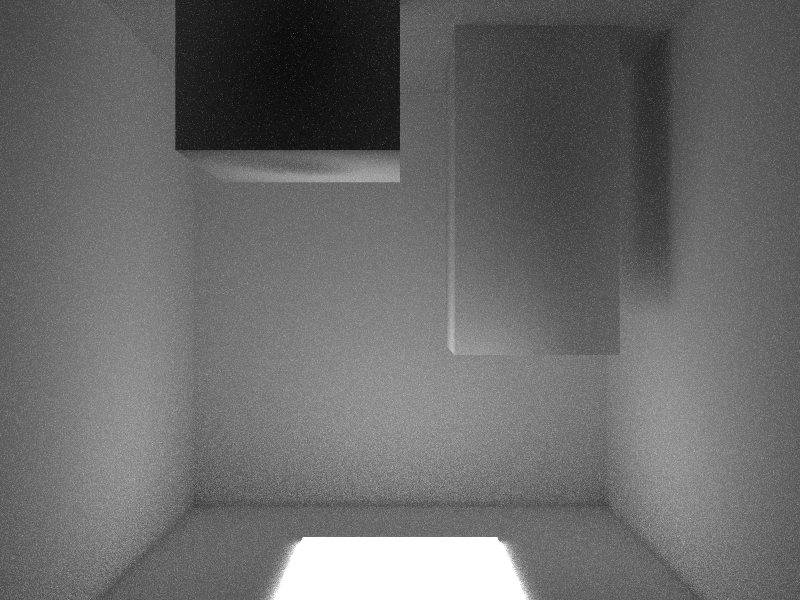
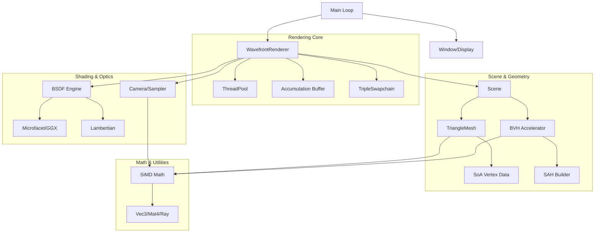

# Xenon — High-Performance Wavefront Path Tracer

Xenon is a modern, CPU-based path tracer written in C++20. It employs a **wavefront-style architecture** designed for cache efficiency and SIMD-friendliness, capable of rendering photorealistic scenes with complex lighting.



## Features

- **Wavefront Path Tracing:** Decouples ray generation, intersection, and shading stages. This architecture improves instruction cache coherence and allows for massive parallelism.
- **Next Event Estimation (NEE):** Significantly reduces noise by explicitly sampling light sources at each bounce.
- **Multiple Importance Sampling (MIS):** Robustly combines BSDF and light sampling strategies to handle varying light sizes and material roughness.
- **Physically Based Materials:** Principled BSDF with support for Lambertian diffuse, GGX microfacet specular, and stochastic dielectric/plastic lobes.
- **SIMD Optimized:** 4-way SIMD math primitives for BVH traversal and ray-triangle intersection.
- **SAH-optimized BVH:** High-quality acceleration structure built using surface area heuristic.
- **Correct Integration:** Unbiased estimator with consistent PDF handling and energy-conserving BSDFs.
- **Progessive Preview:** Interactive real-time preview via GLFW/OpenGL with correct image orientation.
- **Multi-threaded:** Scalable performance using a dynamic tile-dispatched thread pool.

## System Architecture

The following diagram illustrates the relationship between the major components of Xenon:



## Getting Started

### Prerequisites

- **CMake** (version 3.20 or higher)
- **C++20 Compiler** (GCC 10+, Clang 12+, or MSVC 2019+)
- **GLFW3**
- **OpenGL**
- **PkgConfig** (on Linux)

### Building

You can build the project manually with CMake:

```bash
mkdir build
cd build
cmake -DCMAKE_BUILD_TYPE=Release ..
make -j$(nproc)
```

Alternatively, use the provided helper script:

```bash
./xenon.sh --build
```

### Running

To render the default Cornell Box scene:

```bash
./xenon.sh --samples 256 --output my_render.png
```

Command line arguments:
- `--samples N`: Total number of samples per pixel.
- `--scene PATH`: Path to the `.xenon` scene file.
- `--output NAME`: Filename for the final image.
- `--bounces N`: Maximum light bounces.

## Project Structure

- `src/camera/`: Camera models and sampling patterns.
- `src/display/`: Windowing and OpenGL display logic.
- `src/geometry/`: Meshes, AABBs, and BVH acceleration.
- `src/material/`: Physical material models (BSDF).
- `src/math/`: Core math primitives and SIMD optimizations.
- `src/render/`: The core wavefront integrator and thread pool.
- `src/scene/`: Scene loading and management.
- `tests/`: Unit tests for core components.

## License

This project is for educational purposes. Third-party libraries like `stb_image_write` are property of their respective owners.
